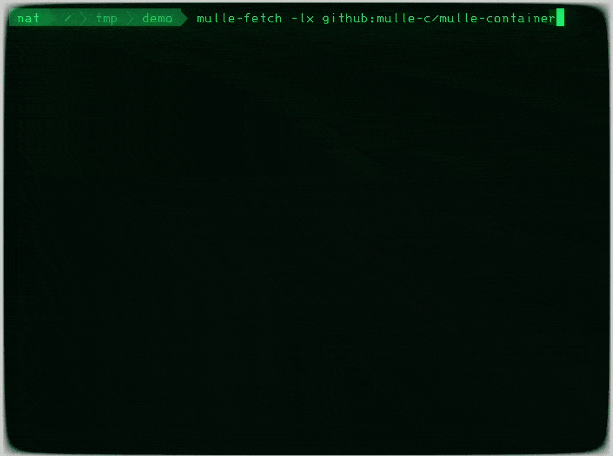
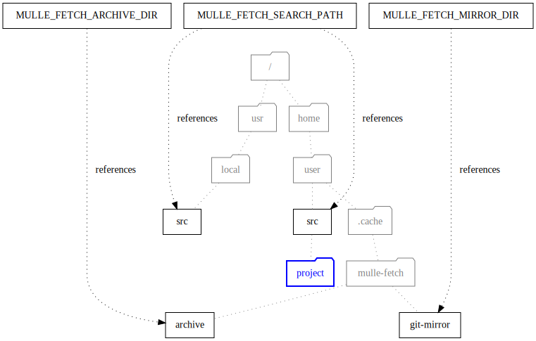

# 🏃🏿 Download and unpack source repositories or archives

... for Android, BSDs, Linux, macOS, SunOS, Windows (MinGW, WSL)

Downloads [zip](http://eab.abime.net/showthread.php?t=5025) and
[tar](http://www.grumpynerd.com/?p=132) archives.
Clones [git](//enux.pl/article/en/2014-01-21/why-git-sucks) repositories and it
can also checkout [svn](//andreasjacobsen.com/2008/10/26/subversion-sucks-get-over-it/).
Can search for and symlink local projects in favor over fetching "stuff".



| Release Version                                       | Release Notes
|-------------------------------------------------------|--------------
|   | [RELEASENOTES](RELEASENOTES.md) |


## What mulle-fetch does

Essentially, `mulle-fetch` is a shortcut for:

``` sh
curl -o download.tgz ${URL}
tar xfz download.tgz
mv download "${DST}"
```

One invariably specifies the **url** to download from and the **destination**
directory to download to. The destination directory must not exist yet.


#### Download and unpack a tar archive:

Here the version is specified in the URL

``` sh
mulle-fetch fetch -s tar https://github.com/mulle-nat/mulle-c11/archive/1.3.5.tar.gz mulle-c11
```


#### Clone a git repository:

Use a tag to checkout a specific version:

``` sh
mulle-fetch fetch -t '1.3.5' https://github.com/mulle-nat/mulle-c11.git mulle-c11
```

#### Or even more convenient:

mulle-fetch can often guess the correct type and project-name of an URL. Just
give it the URL and let the magic happen:

``` sh
mulle-fetch https://github.com/mulle-nat/mulle-c11/archive/1.3.5.tar.gz
```


## Reduce bandwidth


A typical setup might look like this:




### Use a mirror for git repositories

If you clone certain (git) repositories often, it can be useful to use a mirror
to lighten the bandwidth load with `--mirror-dir`:

``` sh
mulle-fetch fetch --mirror-dir ~/.cache/mulle-fetch/git-mirror/ \
   https://github.com/mulle-nat/mulle-c11.git mulle-c11
```

This will still create network connections to update the mirror. If you don't
want that to happen, when a repository has a mirror use the `--no-refresh`
option.

``` sh
mulle-fetch fetch --no-refresh --mirror-dir ~/.cache/mulle-fetch/git-mirror/ \
   https://github.com/mulle-nat/mulle-c11.git mulle-c11
```

> You can also set the environment variable `MULLE_FETCH_MIRROR_DIR`.


### Use a cache for archives

If you download archives often, it can be useful to cache them, to lighten the
bandwidth load with `--cache-dir`:

```
mulle-fetch fetch --cache-dir ~/.cache/mulle-fetch/archive \
   https://github.com/mulle-nat/mulle-c11/archive/1.3.5.tar.gz mulle-c11
```

> You can also set the environment variable `MULLE_FETCH_ARCHIVE_DIR`.


### Use a search path for local repositories

Before actually cloning or checking out a repository, you can let
**mulle-fetch** search through some local directories to find a matching
repository. This is an alternative to mirroring and especially useful for
repositories that are only locally available.

In the next example the option `--search-path` instructs **mulle-fetch** to
look for a repository named `mulle-c11` in `${HOME}/src` and
then in `/usr/local/src`. If nothing is found the repository is cloned from
`https://github.com/mulle-nat/mulle-c11.git`:

``` sh
mulle-fetch fetch --search-path ${HOME}/src:/usr/local/src \
   https://github.com/mulle-nat/mulle-c11.git mulle-c11
```

> You can also set the environment variable `MULLE_FETCH_SEARCH_PATH`.

### Create symbolic links to local projects

> Symbolic links are not available on mingw.

It may be inconvenient to clone a local project repository, when its
development is still ongoing. You'd have to sync the clone to often.
You can allow **mulle-fetch** with `--symlink` to install a symlink instead with:

``` sh
mulle-fetch fetch --symlink --search-path ${HOME}/src:/usr/local/src \
   https://github.com/mulle-nat/mulle-c11.git mulle-c11
```

Since one is not actually cloning anything the found project directory, does
not need to be under version control.


### Search for best matching URL

For github archives and repositories you can search for the best fitting
release archive with a special "tag filter" syntax, that expresses version
ranges. For this to work the releases must be tagged in [semantic versioning]
style.

For example '>= 1.0.0 AND < 2.0.0' would get you the lastet version 1. A tag
filter is of the form

| Filter                      |
|-----------------------------|-------------------
| 'newest:' &lt;qualifier&gt; | Use the newest compatible version
| 'oldest:' &lt;qualifier&gt; | Use the oldest compatible version
&lt;qualifier&gt;             | same as `newest:`, just shorter


| Qualifier                 | Description
|---------------------------|-----------------------
| &lt;unary qualifier&gt;   | These qualifiers compare the github version with your value
| &lt;binary qualifier&gt;  | Boolean logic AND and OR
| `(` &lt;qualifier&gt; `)` | As there is no precedence, use parentheses to express it


| Unary Qualifier      | Example
|----------------------|-------------
| `>=` &lt;version&gt; | `>= 1.0.0`  of [ 0.0.0, 1.0.0, 2.0.0 ] gives 2.0.0
| `<=` &lt;version&gt; | `<= 1.0.0`  of [ 0.0.0, 1.0.0, 2.0.0 ] gives 1.0.0
| `<`  &lt;version&gt; | `< 1.0.0`   of [ 0.0.0, 1.0.0, 2.0.0 ] gives 0.0.0
| `>`  &lt;version&gt; | `> 1.0.0`   of [ 0.0.0, 1.0.0, 2.0.0 ] gives 2.0.0
| `!=` &lt;version&gt; | `!= 1.0.0`  of [ 0.0.0, 1.0.0, 2.0.0 ] gives 2.0.0
| `==`  &lt;version&gt;| `== 1.0.0`  of [ 0.0.0, 1.0.0, 2.0.0 ] gives 1.0.0
| &lt;version&gt;      | same as `==`


| Binary Qualifier                          | Example
|-------------------------------------------|-----------------
| &lt;qualifier&gt; `AND` &lt;qualifier&gt; | `>= 1.0.0 AND < 2.0.0`  of [ 0.0.0, 1.0.0, 2.0.0 ] gives 1.0.0
| &lt;qualifier&gt; `OR` &lt;qualifier&gt;  | `>= 1.0.0 OR == 0.0.0` of [ 0.0.0, 1.0.0, 2.0.0 ] gives 0.0.0


| Version                  | Description
|--------------------------|-------------------------------------------
| [0-9]+'.'[0-9]+'.'[0-9]+ | A version is a semantic versioning triple


### Examples

Use version 3.2.x or better up to but not including version 3.3:

``` sh
mulle-fetch url \
      --scm tar \
   '>= 3.2.0 AND < 3.3.0' \
   https://github.com/mulle-c/mulle-c11
```

Use version 1 or better up, but skip known problem versions 1.0.2 and 1.0.3


``` sh
mulle-fetch url \
      --scm zip \
   '>= 1.0.0 AND != 1.0.2 AND != 1.0.3' \
   https://github.com/mulle-c/mulle-allocator
```


## Install

See [mulle-sde-developer](//github.com/mulle-sde/mulle-sde-developer) how to
install mulle-sde, which will also install mulle-fetch with required
dependencies.

The command to install only the latest mulle-fetch into
`/usr/local` (with **sudo**) is:

``` bash
curl -L 'https://github.com/mulle-sde/mulle-fetch/archive/latest.tar.gz' \
 | tar xfz - && cd 'mulle-fetch-latest' && sudo ./bin/installer /usr/local
```


## Author

[Nat!](https://mulle-kybernetik.com/weblog) for Mulle kybernetiK


